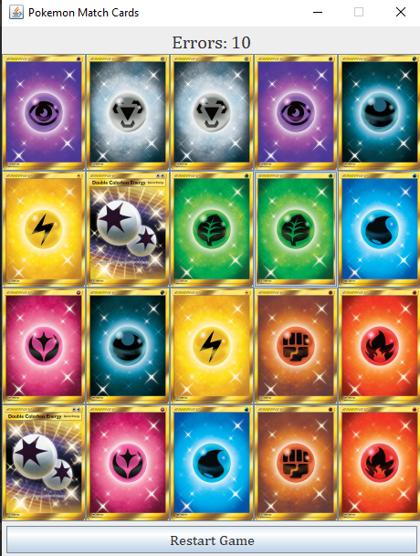

# 🧠 Memory Game

A fun memory-matching game built with Java, featuring Pokémon energy cards!

## 🎮 Game Features

- Flip two cards at a time to find matching Pokémon energy symbols
- Tracks number of errors (wrong matches)
- “Restart Game” button to play again
- Engaging and colorful Pokémon card interface

## 🛠️ Technologies Used

- Java
- Java Swing (for GUI)
- IntelliJ IDEA (or your preferred Java IDE)

## 🚀 How to Play

1. Run the game.
2. Click on two cards to flip them.
3. If the cards match, they stay revealed.
4. If not, they flip back, and an error is counted.
5. Match all pairs with the least number of errors!

## 📷 Screenshot



## 📂 How to Run the Game

1. Clone the repository:
   ```bash
   git clone https://github.com/vsk612203095/Memory-Game.git
